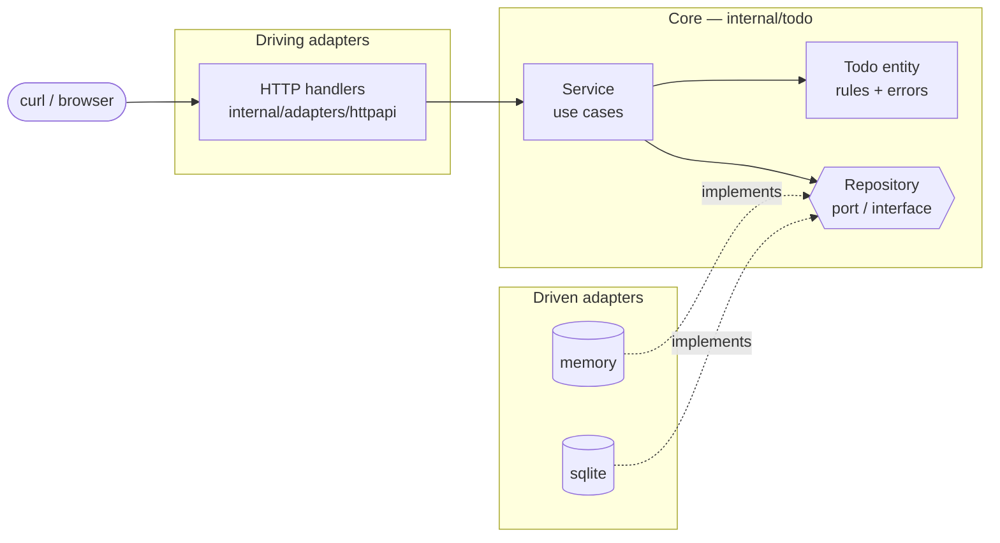

# 00 — Overview

Read this before stage 1. It covers the ideas every later stage relies on: the architecture we're building toward, the one rule that keeps it clean, the test-first loop, and a cheat sheet of what's changed in Go since you last used it.

## What we're building

A REST API for todos:

| Method | Path | What it does |
| --- | --- | --- |
| `POST` | `/todos` | create a todo from `{"title": "..."}` |
| `GET` | `/todos` | list all todos |
| `GET` | `/todos/{id}` | fetch one |
| `PATCH` | `/todos/{id}/complete` | mark it done |
| `DELETE` | `/todos/{id}` | remove it |

The domain is deliberately boring. The interesting part is *how* the code is organised and tested.

## Hexagonal architecture in five minutes

Hexagonal architecture is also called **ports and adapters**. The idea is to put your business logic in the middle, and keep everything that talks to the outside world (HTTP, databases, the clock, the terminal) at the edges.



If your viewer doesn't render Mermaid, here's the same picture in plain text:

```text
   curl ──▶ [ HTTP adapter ] ──▶ ┌──────── core: internal/todo ────────┐
                                 │  Service ──▶ Todo (rules, errors)   │
                                 │     │                               │
                                 │     └──▶ Repository (interface) ◀───┼── [ memory adapter ]
                                 └─────────────────────────────────────┘   [ sqlite adapter ]
```

The terms:

- **Core.** The `Todo` type, its rules ("a title can't be empty"), and the **service** that carries out use cases ("create a todo", "complete a todo"). It's plain Go: no HTTP, no SQL, no logging library.
- **Port.** An interface the core *declares* to describe something it needs. Our main one is `Repository`: "something that can save and load todos". The core says what it needs; it doesn't care how that happens.
- **Driven adapter.** Code that *implements* a port using real technology. In stage 3 we write an in-memory one, and in stage 7 a SQLite one. The core can't tell them apart.
- **Driving adapter.** Code that *calls into* the core from outside. Our HTTP handlers translate requests into service calls and service results into JSON.
- **Composition root.** `cmd/todo-api/main.go`: the one place that knows about everything and connects it together.

**Why bother?** Three practical reasons:

1. **Tests are fast and simple.** The core can be tested with no server and no database.
2. **Swapping technology is cheap.** Stage 7 swaps in SQLite without touching the core or the HTTP code.
3. **Each piece has one job.** HTTP concerns stay in the HTTP adapter and SQL concerns in the SQL adapter.

## Where things live

```text
go-test/
├── go.mod
├── cmd/todo-api/main.go        # composition root (stage 4+)
├── internal/
│   ├── todo/                   # CORE — standard library only
│   │   ├── todo.go             #   entity + rules          (stage 2)
│   │   ├── ports.go            #   Repository interface    (stage 3)
│   │   └── service.go          #   use cases               (stage 3)
│   ├── adapters/
│   │   ├── memory/             #   in-memory Repository    (stage 3)
│   │   ├── httpapi/            #   REST handlers           (stage 4)
│   │   └── sqlite/             #   SQLite Repository       (stage 7)
│   └── platform/               #   logging, config, middleware (stages 5–6)
└── docs/guide/                 # you are here
```

`internal/` is special in Go: code inside it can only be imported by code in the same module. It's the standard way to say "these packages are not a public library".

## The dependency rule

> **Dependencies point inward.** Adapters, platform code, and `main` may import `internal/todo`. `internal/todo` imports **only the standard library**.

This rule makes the architecture real rather than a naming convention. You can check it at any time:

```sh
go list -deps -f '{{if not .Standard}}{{.ImportPath}}{{end}}' ./internal/todo
```

This lists every package `internal/todo` depends on, directly or indirectly, and hides standard-library ones. The **only** line it should print is the package itself (for example `example.com/todo/internal/todo`). If it ever prints an adapter or a third-party module, the core has started depending on something it shouldn't.

You'll run this at the checkpoint of every stage from stage 2 on.

## The TDD loop

Every step in every stage follows the same rhythm:

1. **Red.** Write a small test for one behaviour that doesn't exist yet. Run it and **watch it fail**.
2. **Green.** Write the simplest code that makes it pass. Run it and watch it pass.
3. **Refactor.** Tidy up names and duplication while the tests stay green.
4. **Repeat** for the next behaviour. Commit when the stage is done.

**Why watch it fail?** A test you've never seen fail might not be testing anything. It could have a typo, check the wrong thing, or never run. Seeing the failure first, *with the failure message you expected*, is how you know the test works.

In Go there are two kinds of "red":

- **A compile error** (`undefined: NewTodo`). This is normal on the very first run, because the test refers to code that doesn't exist yet. Add just enough code to compile, such as a function that returns zero values, then run again.
- **An assertion failure** (`got "", want "buy milk"`). This is the red you're really after. It proves the test checks behaviour.

## If you remember old Go…

A cheat sheet of the changes you're most likely to notice. The guides point these out when they come up.

| You might remember | Now it's | Since |
| --- | --- | --- |
| `GOPATH`, code under `~/go/src/...` | **Modules**: a `go.mod` in any folder; `go mod init`, `go get` | 1.11–1.16 |
| `interface{}` | `any` (an alias, same thing) | 1.18 |
| No generics | Type parameters: `func Map[T, U any](...)` | 1.18 |
| `for _, v := range xs { go f(&v) }` bugs | Each loop iteration gets its **own** `v` | 1.22 |
| `for i := 0; i < n; i++` | Also `for i := range n` | 1.22 |
| Third-party routers for `/todos/:id` | `http.HandleFunc("GET /todos/{id}", ...)` and `r.PathValue("id")` | 1.22 |
| `log.Printf` or a third-party structured logger | `log/slog` in the standard library | 1.21 |
| `if err.Error() == "..."` | `errors.Is`, `errors.As`, wrapping with `fmt.Errorf("...: %w", err)` | 1.13 |
| Writing your own `min`/`max` | Built-in `min(a, b)` and `max(a, b)` | 1.21 |
| `ioutil.ReadAll` | `io.ReadAll`, `os.ReadFile` (`ioutil` is deprecated) | 1.16 |
| Shipping static files alongside the binary | `//go:embed` to bake files into the binary | 1.16 |
| `rand.Seed(time.Now().UnixNano())` | Not needed: `math/rand/v2` is seeded automatically | 1.20/1.22 |

## How reviews work

When you finish a stage, tell Claude **"done with stage N"**. Claude will:

1. run `go test ./...`, `go vet ./...`, and `gofmt -l .`
2. read the code you wrote for that stage
3. check the dependency rule above
4. give feedback grouped as **Must fix**, **Idiomatic Go**, and **Optional polish**

Claude won't change your code unless you ask. Before the next stage, Claude may update that stage's guide to use the names and choices you actually made.

## Stages

1. [Tooling](01-tooling.md): modules, packages, `go test`, table-driven tests
2. [Domain](02-domain.md): the `Todo` type, its rules, and errors as values
3. [Ports and service](03-ports-and-service.md): interfaces, fakes, `context`, the in-memory adapter
4. [HTTP adapter](04-http.md): routing, JSON, `httptest`, error-to-status mapping
5. [Logging](05-logging.md): `log/slog`, middleware, testing log output
6. [Running it properly](06-running-properly.md): config, graceful shutdown, request IDs
7. [SQLite adapter](07-sqlite.md): `database/sql`, `embed`, one contract suite for both adapters

Next: [01 — Tooling](01-tooling.md)
